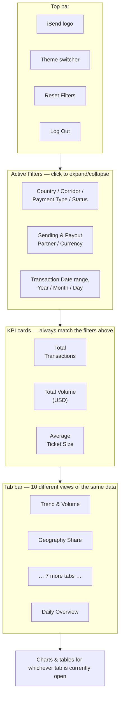

# Dashboard Guide (for everyday users)

This is a plain-language guide to using the Transaction Dashboard — no
coding or technical knowledge needed. If you're looking for setup/install
instructions instead, see `README.md`; if you're a developer, see
`CLAUDE.md` and `WORKFLOW.md`.

## What is this?

A single web page that shows, in real time, how iSend's transactions are
performing — how much money is moving, how many transactions, how fast
they're being paid out, which partners and corridors are busiest, and
where things might be going wrong. It pulls from the same underlying data
Accounts uses for their own reporting, so the numbers here are meant to
match theirs.

## Logging in

Open the dashboard's web address in your browser. You'll land on a login
screen — enter the email and password you were given by whoever
administers the dashboard (there's no self-signup; accounts are created
for you).

Once logged in, you'll stay logged in for a while even if you close the
tab — you only need to log in again after a longer period of inactivity.
When you're done, use the **Log Out** button in the top-right corner —
this properly ends your session rather than just leaving the tab open.

## The screen, top to bottom

- **Top bar** — the iSend logo, a theme switcher (a few color themes to
  choose from, purely cosmetic), a **Reset Filters** button, and **Log
  Out**.
- **Active Filters** — a collapsible panel (click the heading to
  expand/collapse it) with every filter available: Sending/Receiver
  Country, Corridor, Payment Type, Transaction Status, Sending/Payout
  Partner, Sending/Payout Currency, a Transaction Date range, and
  Year/Month/Day. Pick any combination — every chart and table on every
  tab updates to match, instantly (no page reload). **Reset Filters**
  clears all of them back to "show everything."
- **The three big numbers** (KPI cards) — Total Transactions, Total
  Volume (USD), and Average Ticket Size, always reflecting whatever
  filters are currently active. These are the fastest way to sanity-check
  "how big is what I'm currently looking at."
- **Tabs** — ten different views of the same underlying data, each
  answering a different question. Covered one by one below.

## The tabs

### Trend & Volume
The default landing tab. Monthly charts: total volume and transaction
count over time, average ticket size over time, and month-over-month
percentage change. **Use this for:** "are we growing?", "was last month
better or worse than the month before?"

### Geography Share
Bar charts ranking Sending and Receiving countries by both transaction
count and volume, plus detailed breakdown tables (country → partner →
country). **Use this for:** "which countries send/receive the most?",
"which partner handles a specific country pair?"

### Partner Breakdown
Tables breaking down performance by Sending Partner and Payout Partner,
each crossed with Corridor, showing transactions/volume/average ticket
size. **Use this for:** "how is a specific partner performing?"

### Corridors & Currencies
Performance by corridor (a sending-country → receiving-country pairing)
and by currency pair. **Use this for:** "which corridors do the most
business?", "which currency pairs are most common?"

### Bracket & Status
Three things at once: a donut chart showing what share of volume is in
each transaction status (Payment, Pending, Failed, etc.), a table with
the exact numbers behind it, a chart breaking volume down by transaction
size ("bracket" — e.g. $0-500, $500-1000, and so on), and a chart showing
which statuses show up in which size brackets. **Use this for:** "how much
of our volume is actually completing successfully?", "are large
transactions more or less likely to fail?"

### Top / Bottom
The 15 best- and 15 worst-performing entries, for five different things
(Sending Partner, Payout Partner, Sending Country, Receiver Country,
Corridor) across three measures (Transactions, Volume, Average Ticket
Size). **Use this for:** "who are our best partners?", "which corridors
are underperforming and might need attention?"

### GCC
The same trend charts and breakdown tables as the main tabs, but narrowed
to only transactions sent from Gulf Cooperation Council countries (Saudi
Arabia, UAE, Qatar, Kuwait, Bahrain, Oman). **Use this for:** a focused
view when GCC business specifically is under discussion.

### TAT Analysis
"TAT" = Turn-Around Time — how long between a transaction being created
and it actually being paid out. Shows average and median TAT, plus a
breakdown of how many transactions fall into each speed bucket (under an
hour, 1-6 hours, 6-24 hours, 1-3 days, 3-7 days, over a week). **Use this
for:** "how fast are we actually paying people?", "is turnaround getting
slower for a specific partner or corridor?" This is the one tab where the
underlying time calculation is deliberately adjusted for timezone so it
reflects true elapsed hours, even though which month/day a transaction is
grouped under still matches every other tab (see the technical docs if
you're curious why that distinction matters).

### Segmentation Overview
Performance grouped by "Agent Segment" (a tiering of sending partners),
plus a chart showing transaction status by segment. **Use this for:**
"how does our top tier of partners compare to the rest?"

### Daily Overview
A calendar-style table: each row is a day of the month (1-31), each
column is a month, and each cell shows transactions/volume/average ticket
for that exact day — color-shaded so busier days stand out at a glance.
**Use this for:** spotting patterns like "are certain days of the month
consistently busier?" (e.g. salary days, month-end).

## A few things worth knowing

- **Every chart and table respects the filters at the top of the page.**
  If a number looks lower than expected, check whether a filter is still
  narrowing things down — the collapsed filter panel doesn't always make
  this obvious. **Reset Filters** is the fastest way to check.
- **Numbers here are meant to match Accounts' own MIS.** If something
  looks off, it's worth flagging rather than assuming the dashboard is
  wrong — but the underlying date handling was specifically fixed to
  agree with Accounts' reporting, so a mismatch is worth investigating.
- **Data isn't live-live.** It updates whenever the data-refresh job is
  run (see whoever administers this for the current schedule) — think of
  it as "as of the last refresh," not "as of this second."
- **The Forecast tab has been temporarily disabled** — predictive
  forecasting isn't ready yet, so it's hidden until it is.
- **If the page ever takes a long time to load** (more than 30-60
  seconds), that's a known possibility depending on server conditions,
  not necessarily something wrong with your connection — give it a minute
  before assuming it's stuck.
