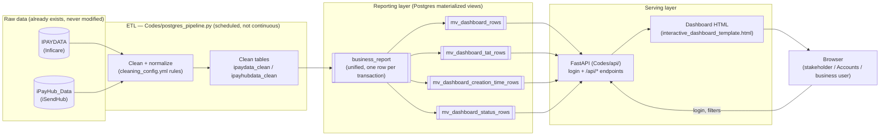
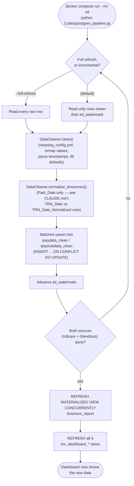
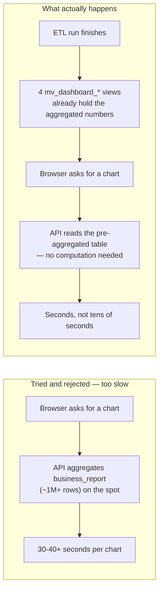
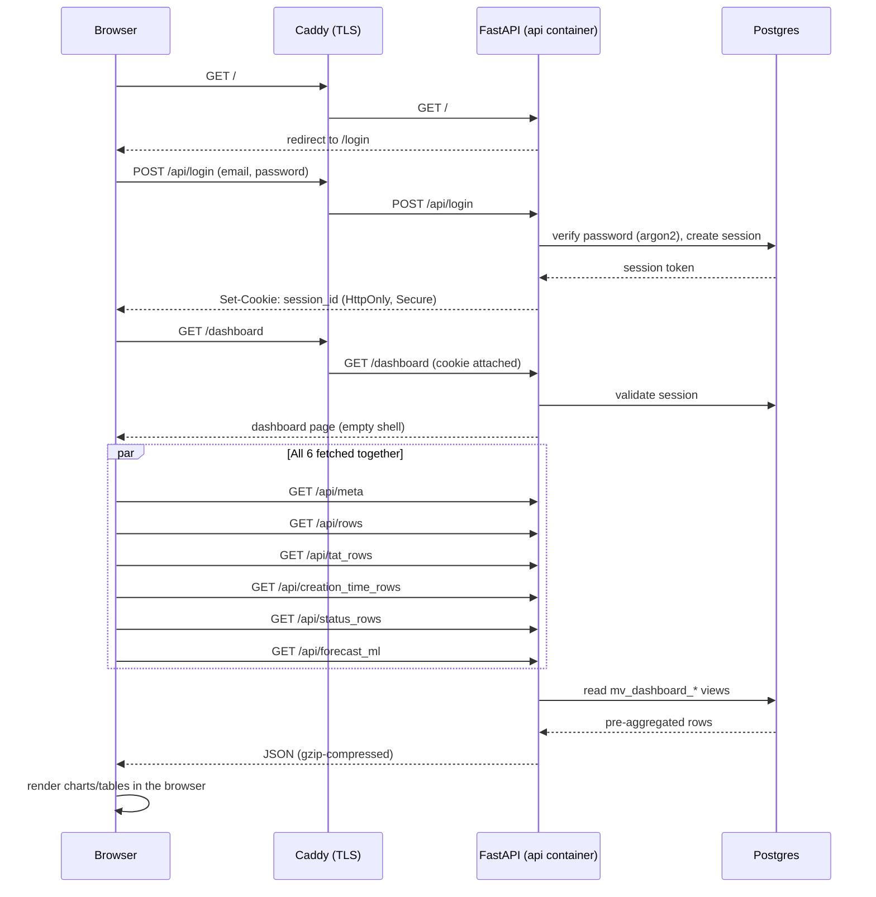
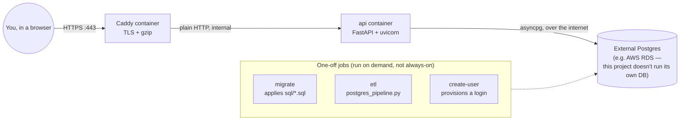

# Project Workflow

A visual walkthrough of how data moves through this project, end to end —
from the two raw source tables to what a stakeholder sees in their
browser. Written for anyone getting oriented on this codebase; see
`CLAUDE.md` for the deep implementation detail behind each step, and
`README.md` for the exact commands.

## 1. The big picture

**In plain terms:** the two raw tables are never touched directly by the
dashboard. A scheduled job (the ETL) copies and cleans their data into
Postgres's own storage, builds one unified table (`business_report`), then
pre-computes four ready-to-chart summary tables from it. The dashboard's
web server only ever reads those four summary tables — never the raw
ones, and never `business_report` directly (see step 3 for why).

## 2. ETL run, in detail

**In plain terms:** this is the only step that changes what the dashboard
shows. Nothing updates live as new transactions happen — someone (or a
scheduled task) has to run the ETL, which takes the latest raw data,
cleans it, and refreshes the reporting tables. Until that runs, the
dashboard keeps showing whatever it showed after the last run.

## 3. Why the dashboard reads pre-computed summaries, not raw data live

**In plain terms:** aggregating a million-plus rows every time someone
opens a tab was measured directly and found far too slow. So that
aggregation work happens once, right after the ETL run, and the dashboard
just reads the already-summarized result.

## 4. Logging in and loading the dashboard

**In plain terms:** the page itself loads almost instantly — it's an
empty shell. The moment it appears, the browser fires off six requests at
once for the actual numbers, and only once those come back do the charts
draw themselves in. That wait is what a "Loading dashboard data…" screen
is showing.

## 5. How the whole thing is deployed (Docker)

**In plain terms:** only two containers run continuously — `caddy`
(handles HTTPS) and `api` (serves the dashboard). Everything else
(migrations, ETL, creating an account) is run by hand, once, whenever
it's needed, against the same external database. See `README.md`'s
Docker section for the exact commands, and its "Deploying a CODE change"
note — editing code doesn't reach the running `api` container until it's
rebuilt.

## 6. What each document in this repo is for

| Document | Audience | What it's for |
|---|---|---|
| `README.md` | Anyone setting this up | Step-by-step install/run instructions |
| `CLAUDE.md` | Developers/maintainers | Full architecture, every design decision and why, gotchas |
| `WORKFLOW.md` (this file) | Anyone getting oriented | The same flow as `CLAUDE.md`, but as pictures |
| `DASHBOARD_GUIDE.md` | Dashboard end-users (non-technical) | What the dashboard shows, tab by tab, in plain language |
